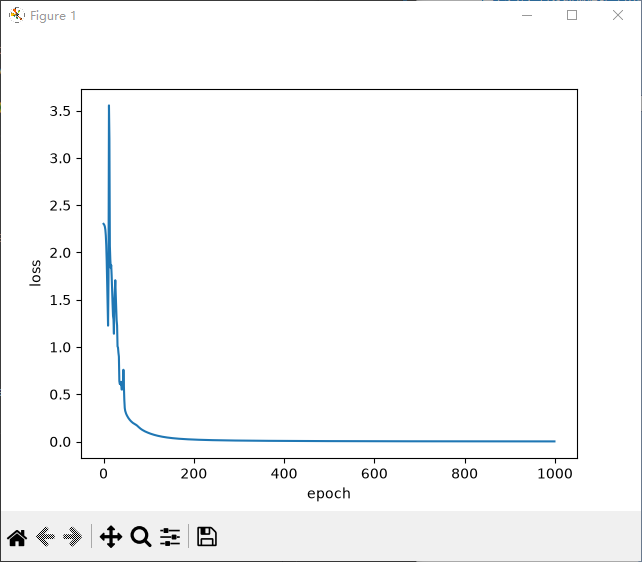
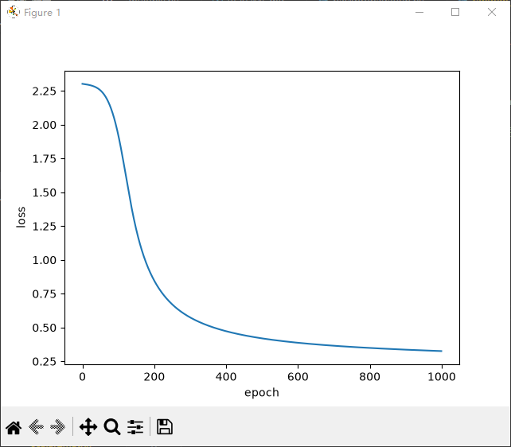
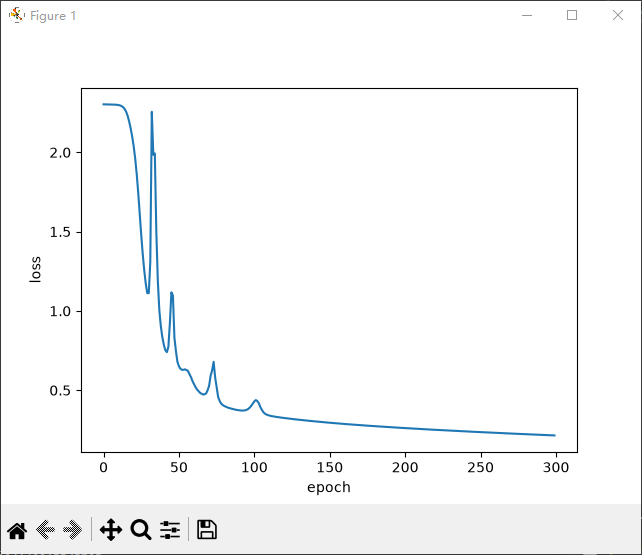
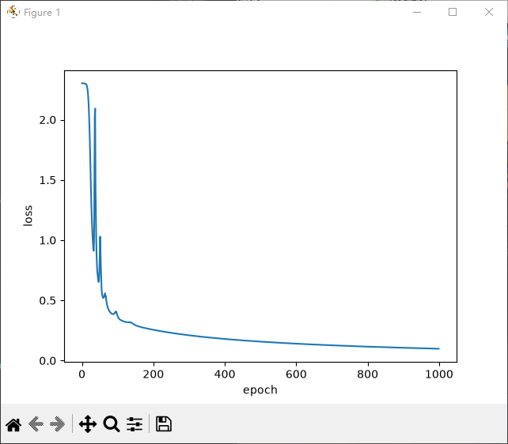

# AILearning  
## Python基础 pybasic    
### Python语法速通 basic  
- 类的基础  
  class_basic.py  
- 模拟"前向传播"和"计算损失"  
  predict_basic.py  
  用列表推导式计算每个预测值的"误差平方" (y_pred - y_true)²
### AI专属工具库
#### Numpy
- Numpy入门-数组与矩阵  
  array_matrix.py  
- Numpy进阶-矩阵乘法  
  matrix_multiply.py  
  teply.py

  NumPy更快：
    1. 向量化运算：一次性操作整个数组，无需Python循环;  
    2. 类型统一：所有元素类型相同，无需类型检查;  
    3. 连续内存：所有元素在内存中紧密排列;  
    4. 预编译的C代码：a + b 调用的是C语言实现的函数;  
    5. SIMD优化：现代CPU一条指令处理多个数据;  

  Python列表更慢:  
    1. Python是动态类型，每次都要检查变量类型;  
    2. 循环由Python解释器逐行执行（慢）;  
    3. 每个元素是独立的Python对象（内存不连续）;
    4. 每次加法都创建新对象;  
#### Matplotlib
- Matplotlib-损失曲线  
  loss_curve.py  
- 字典实现两数之和与反转链表  
  two_sum.py  
  revers_LinkedList.py  
- 异常+文件读写  
  read_file.py  
  handle_exception.py  
- 单神经元网络  
  neuron_network.py  

#### 前向传播、损失函数、梯度下降：  
  - **前向传播:** 输入数据从输入层进入网络，逐层计算，最终输出预测结果的过程。  

          数学描述：对于单神经元网络，假设输入是x, 权重是w, 偏置是b, 激活函数是f: 输出 = f ( w * x + b )	。  

  - **损失函数:** 用来衡量模型预测值与真实值之间差距的函数。差距越大，损失值越大；差距越小，损失值越小。  

          数学描述：用均方误差，L = 1/m * Σ( y_pred_i - y_true_i )^2  

              其中： m         = 样本总数  
                    y_pred_i  = 第i个样本的预测值  
                    y_true_i  = 第i个样本的真实值  

  - **梯度下降:** 一种优化算法，通过计算损失函数对参数的梯度（偏导数），让参数沿着损失减小最快的方向逐步更新，从而最小化损失函数。 通俗比喻： 就像蒙着眼睛站在山坡上，想要走到山脚最低点。你看不见路，但你能用脚探一探周围哪个方向最陡（坡度最大，即最低），然后朝那个方向迈一步。不断重复，最终就能走到谷底。  

          数学描述：w新 = w旧 - η * ( ∂L / ∂w )  

              其中： η（学习率）：步长大小，控制每次迈多大一步;  
                    ∂L/∂w：损失函数对w的梯度，指明了“最陡的下坡方向”。  
  
  - 整个**训练过程**就是：    
      - 前向传播做预测 → 损失函数算差距 → 梯度下降更新参数 → 重复直到损失足够小。  

## 核心工具库与手搓神经网络 nnscratch  
### 从“标量”到“矩阵”（核心理论+代码映射）scalar2matrix  
- 非线性  
  - 为什么要非线性？  
    因为不含非线性的单层是线性（直线），类似于判断一个点是否在圆内的问题，线性模型永远画不出圆形边界。所以需要非线性。  
  - 为什么要多层神经网络？  
    含非线性的单层是简单平面（浅弧线）；而多层网络，则是通过逐层扭曲空间，把‘拧麻花’般复杂的问题，在更高维度上变成一个‘一刀切’的平面问题。  

- 激活函数  
  activation.py  
  作用是“把负数‘掐掉’，保留正数”  
- 矩阵乘法  
  matrix_multiply.py 
  一次性处理整批数据   
- 全连接层  
  fully_connected.py  
  可复用的“线性层”代码模块  
- 两层神经网络  
  two_layer_nn.py  
  数据在网络中的“流动”（前向传播）  
- 损失函数  
  loss.py  
  计算出当前网络在单张图片上的损失值  
- 可视化“随机猜测”  
  random_guess_viz.py  

### 让网络“学习”起来（反向传播+训练）network_learning  

（此为最关键核心重难点，需深入理解，本人耗时约为：4天*4小时=16小时， 从19号到22号） 

- 前置数学知识： 
  矩阵乘法、矩阵转置、矩阵求和、Softmax函数、交叉熵损失、链式法则、ReLU导数等     

- 计算图与链式法则  
  损失 L -> 得分 scores -> 权重 W2 -> 隐藏层 h -> 权重 W1 -> 输入 X  
  反向传播就是从 L 出发，顺着链条反向求导  
  推导出 dL/dW2 和 dL/dW1 的表达式  

- 反向传播（梯度下降、训练循环、可视化训练过程）  
  backpropagation.py    
  梯度在层与层之间流动  

- 评估准确率  
  evaluate_accuracy.py  

- 总结（2层神经网络）
    
  0.0014447927146678476  
  Epoch 999/1000, Loss: 0.0014  
  0.0014426833237984637  
  Epoch 1000/1000, Loss: 0.0014  
  训练完成！  
  测试集准确率为0.8736  

    
  0.325843550654677  
  Epoch 998/1000, Loss: 0.3258  
  0.3257468708930785  
  Epoch 999/1000, Loss: 0.3257  
  0.3256503553571559  
  Epoch 1000/1000, Loss: 0.3257  
  训练完成！  
  测试集准确率为0.9118  

    
  这是降低了初始权重w的6w样本量，学习率为0.00001, 300轮训练  
  0.21600464497167438  
  Epoch 298/300, Loss: 0.2160  
  0.2156154151525585  
  Epoch 299/300, Loss: 0.2156  
  0.2152272201792823  
  Epoch 300/300, Loss: 0.2152  
  训练完成！  
  测试集准确率为0.9394  

    
  这是降低了初始权重w的6w样本量，学习率为0.00001, 1k轮训练  
  0.09859106019786552  
  Epoch 998/1000, Loss: 0.0986  
  0.09851731416002943  
  Epoch 999/1000, Loss: 0.0985  
  0.09844364905368663  
  Epoch 1000/1000, Loss: 0.0984  
  训练完成！  
  测试集准确率为0.9671  

- 最终结果总结  
  | 指标 | 数值 |  
  |---|---|  
  | 训练集大小 | 60000 张 |  
  | 训练轮数 | 1000 轮 |  
  | 最终训练 Loss | 0.0984 |  
  | 测试集准确率 | 96.71% |  
  | 模型结构 | 784 → 64 → 10 |  
  

